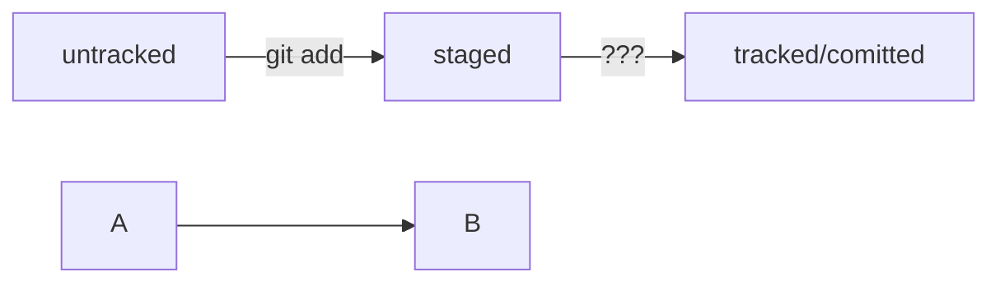

# Git-Help!


** pwd ** отобразить текущий путь

** cd имя\_папки\ **    перейти в директорию

** cd ~ ** домашняя директория

** cd .. ** вернуться на уровень выше

**ls**  вывести содержимое директории

**ls -a**  вывести расширенный список. В нём отобразятся все скрытые файлы

**ls ~** выведет содержимое домашней директории вне зависимости от того, что показывает `pwd`.

**ls ..** покажет содержимое родительской директории.


**touch %ИМЯ\_ФАЙЛА%\** создать файл

**mkdir** создание директорий


```Bash

$ mkdir new-dir # создали директорию new-dir


$ mkdir -p dir1/dir-inside/dir-deeper-inside

\\# создали папку dir-deeper-inside в папке dir-inside, которая находится в папке dir1

```


**cp** копировать файл, принимает два параметра: `что копируем` и `куда копируем`.


``` BASH

$ cp что\\\_копируем куда\\\_копируем


$ cp index.html src/

\\# скопировали index.html в папку src

```

Но можно указать сразу несколько файлов.


```BASH

$ cp что\\\_копируем что\\\_копируем что\\\_копируем куда\\\_копируем


$ cp index.html style.css script.js src/

\\# скопировали три файла (index.html, style.css и script.js) в папку src

```


**cp -r** скопировать директорию


**mv** переместить файл или папку


```BASH

$ mv table.csv ./very-important-files

\\# сначала указываем имя файла, который хотим переместить, потом путь — куда перемещаем 


$ cd very-important-files

$ ls

table.csv 

\\# перешли в папку very-important-files и проверили, что всё сработало

```


**cat** - чтение файлов, работает только с текстовыми файлами


rm - удаление файлов


``` BASH

$ rm example.txt # удалили файл example.txt из текущей папки

```


rmdir - удалить директорию


```BASH

$ rmdir images # команда удалит папку images из текущей директории, 

\&nbsp;              # если папка images пуста

```


**rm -r** удалит папку и все файлы в ней

```BASH

$ rm -r images # удалили папку images со всем её содержимым из текущей директории

```


Команды в терминале необязательно вбивать и выполнять по очереди. Их можно указывать не по одной, а сразу списком. Для этого их нужно разделить двумя амперсандами (`\\\&\\\&`).


```BASH

$ mkdir second-project \\\&\\\& cd second-project \\\&\\\& touch index.html style.css

\\# создаём папку second-project,

\\# переходим в папку second-project

\\# и создаём в ней два файла: index.html и style.css

```


### Инициализация репозитория


`git init` (от англ. \_\*\*init\*\*ialize\_, «инициализировать») — инициализируй репозиторий.


### Подготовка файла к коммиту


`git add todo.txt` (от англ. \_add\_, «добавить») — подготовь файл `todo.txt` к коммиту;


`git add --all` (от англ. \_add\_, «добавить» + \_all\_, «всё») — подготовь к коммиту сразу все файлы, в которых были изменения, и все новые файлы;


`git add .` — подготовь к коммиту текущую папку и все файлы в ней.


### Создание коммита


`git commit -m "Комментарий к коммиту."` (от англ. \_commit,\_ «совершать», «фиксировать» + \_\*\*m\*\*essage,\_ «сообщение») — сделай коммит и оставь комментарий, чтобы было проще понять, какие изменения внесены.


### Просмотр информации о коммитах


`git log` (от англ. \_log\_, «журнал \[записей]») — выведи подробную историю коммитов.


### Просмотр состояния файлов


`git status` (от англ. \_status\_, «статус», «состояние») — покажи текущее состояние репозитория.


Хеш — идентификатор коммита

Хеширование (от англ. hash, «рубить», «крошить», «мешанина») — это способ преобразовать набор данных и получить их «отпечаток» (англ. fingerprint).
Информация о коммите — это набор данных: когда был сделан коммит, содержимое файлов в репозитории на момент коммита и ссылка на предыдущий, или родительский (англ. parent), коммит. Git хеширует (преобразует) эту информацию с помощью алгоритма SHA-1 (от англ. Secure Hash Algorithm — «безопасный алгоритм хеширования») и получает для каждого коммита свой уникальный хеш — результат хеширования.


HEAD

При вызове команды git log вы также могли заметить надпись (HEAD -> master) после хеша одного из коммитов.
Файл HEAD (англ. «голова», «головной») — один из служебных файлов папки .git. Он указывает на коммит, который сделан последним (то есть на самый новый).


Статусы untracked/tracked, staged и modified
Одна из ключевых задач Git — отслеживать изменения файлов в репозитории. Для этого каждый файл помечается каким-либо статусом. Рассмотрим основные.
untracked (англ. «неотслеживаемый»)

Новые файлы в Git-репозитории помечаются как untracked, то есть неотслеживаемые. Git «видит», что такой файл существует, но не следит за изменениями в нём. У untracked-файла нет предыдущих версий, зафиксированных в коммитах или через команду git add.
staged (англ. «подготовленный»)

После выполнения команды git add файл попадает в staging area (от англ. stage — «сцена», «этап [процесса]» и area — «область»), то есть в список файлов, которые войдут в коммит. В этот момент файл находится в состоянии staged.
tracked (англ. «отслеживаемый»)

Состояние tracked — это противоположность untracked. Оно довольно широкое по смыслу: в него попадают файлы, которые уже были зафиксированы с помощью git commit, а также файлы, которые были добавлены в staging area командой git add. То есть все файлы, в которых Git так или иначе отслеживает изменения.
modified (англ. «изменённый»)

Состояние modified значит, что Git сравнил содержимое файла с последней сохранённой версией и нашёл отличия. Например, файл был закоммичен и после этого изменён.
Вот что ещё важно учесть:
Для файлов в состояниях staged и modified обычно не указывается, что они также tracked, потому что это состояние подразумевается.
Команда git add добавляет в staging area только текущее содержимое файла. Если вы, например, сделаете git add file.txt, а затем измените file.txt, то новое содержимое файла не будет находиться в staging. Git сообщит об этом с помощью статуса modified: файл изменён относительно той версии, которая уже в staging. Чтобы добавить в staging последнюю версию, нужно выполнить git add file.txt ещё раз.


